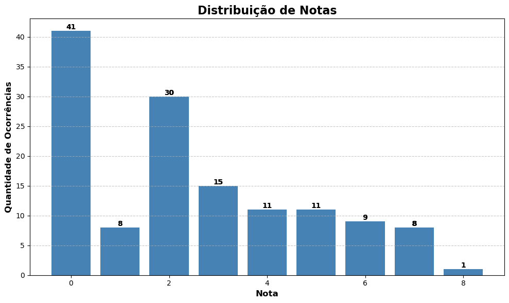

<h1 style="text-align: center; font-weight: bold;">Projeto de análise de dados - Edge academy</h1>

## Demonstração 📸

  

---

## 🚀 Sobre o Projeto

Analisando as notas da prova objetiva do processo seletivo da Edge Academy. 

### 🛠 Tecnologias

As seguintes ferramentas foram usadas na construção do projeto:

- [Python]
- [Numpy]
- [Pandas]
- [Matplotlib]
- [ChatGPT]
---

 

Veja meu Linkedin: [LEANDRO ARAÚJO](https://www.linkedin.com/in/leandro-araujo-silva01/)